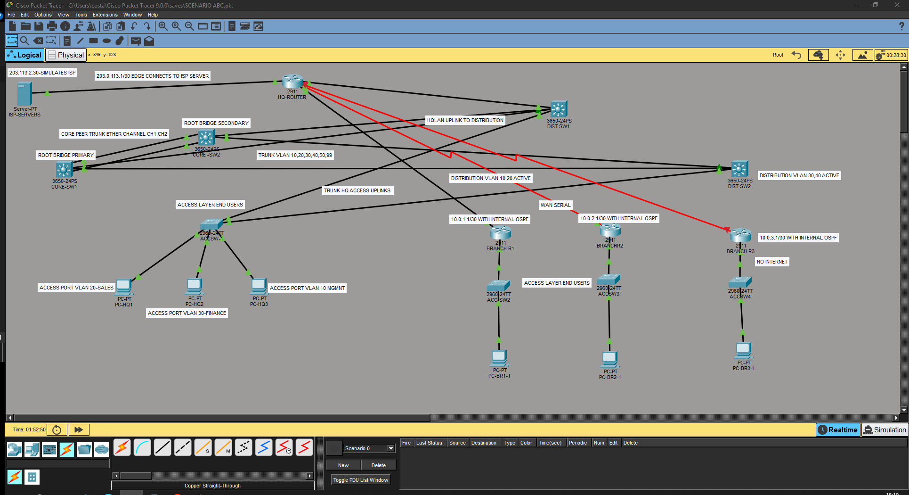

# Lab 1 — STP Failure, HSRP Load Balancing, No-Internet Branch

## Scenarios
- **A:** Core switch failure + RSTP reconvergence
- **B:** HSRP load imbalance across distribution switches
- **C:** Branch site with no internet — local routing tree

## Topology

## Device Configs
| Device | File |
|---|---|
| Core-SW1 | [core-sw1.txt](configs/core-sw1.txt) |
| Core-SW2 | [core-sw2.txt](configs/core-sw2.txt) |
| Dist-SW1 | [dist-sw1.txt](configs/dist-sw1.txt) |
| ... | ... |

## Key Commands to Verify
\`\`\`
show spanning-tree vlan 10
show standby brief
show ip route
\`\`\`

## Screenshots
See `/packettracer-images` folder — numbered before/after.
